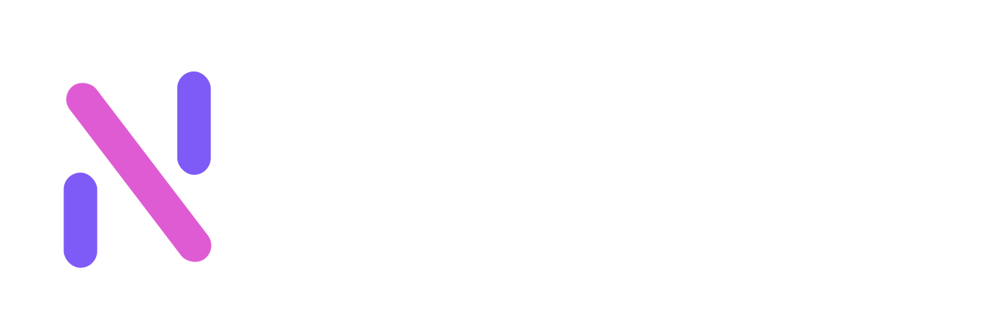

# nyutab

Upgrade your New Tab Page



## Install

[Chrome](https://chrome.google.com/webstore/detail/nyutab/eiikkbmeemdhfgeihpcfaackfofhpebi)

## Demo

You can test the extension without installing it [here](https://nyutab.vercel.app/) but be careful that it will load slowly depending on your internet speed.

If you get a blank page, try clearing the cookies.

## About

I've used many new tab extensions, but none of them worked for me. So I decided to take the best features out of each one and put them here.

Many features are based on personal preferences (F1 Countdown, Dev Posts, Memes...).

I'll provide a way to pick the features you like in the future (if this extension gets noticed).

This is an alpha build, most features might be changed/removed. The design will be overhauled once all the features are implemented.

So please offer your feedback (file bugs, suggest improvements, new features...) on the [issues page](https://github.com/mohamedbechirmejri/nyutab/issues).

## Features

- [x] Quick Links
- [x] Good Design
- [x] Feed
  - [x] Hacker News
  - [x] RSS
  - [x] Reddit
- [x] Memes
- [x] Facts and Quotes
- [x] Weather
- [x] Clock and Date
- [ ] Tools
  - [x] Prayer Times
  - [x] Breathing Exercise
  - [~] Todo List
  - [~] Awesome Lists
  - [ ] ????
- [ ] Games
  - [x] Sudoku
  - [x] Countries
  - [x] Minesweeper
  - [x] 2048
  - [x] Wordle
  - [x] Word Search
  - [x] Reflex Challenge
- [x] Settings
- [x] Image Backgrounds

## Help Me Improve

- If you like this extension or see its potential, please help me by starring and sharing it with everyone you know (and don't know xD).

- Most importantly visit the issues tab and fill it with everything that comes to your mind.

- You can also help by submitting pull requests (improve docs, fix issues...)

## Compatibility

Should Support all browsers but I have only tested Chrome/firefox on Windows 11. I'll test other browsers once v1 comes out.

## Releases

None Yet, I have to finish some basic features before releasing this in stores. you can build it on your own using the steps below.

### How to build

- clone this repo

- install dependencies

```bash
pnpm install
```

- start server

```bash
pnpm dev
```

- rename .env.example to .env and update the values
- build the extension

```bash
pnpm build
```

- enable dev mode in your browser
- drag the build folder to your extensions page
